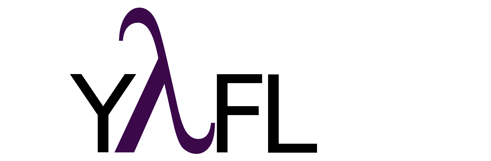

# Yet Another Functional Library
Functional Programming concepts implemented in C++17

# Table of Contents
1. [Introduction](#introduction)
2. [Usage](#usage)
3. [Build](#build)

## Introduction
C++ is a multi paradigm programming language and functional programming concepts keep getting added to the C++ standard.

Yafl is a header only library that implements some key FP concepts, such as curring / uncurring, partial application, function composition, kleisli arrows, and also the Maybe and Either monads (Functor, Applicative Functor and Monad).

This library helps you in reducing code noise and boilerplate code. It can improve readability (if you are accustomed to FP) and it is really fun to use and learn functional concepts.

Most of the concepts present in this library were inspired in some Haskell features, which is a really cool functional programming language

## Examples

### High Order Functions (HOF)
Higher order functions are functions that take one or more functions as arguments, and/or return a function as their result.

#### Function Composition
Function composition is a mechanism that combines simple functions to build more complicated functions. 
Is an operation that takes two functions as arguments and returns a new function where th result of each function is passed as the argument of the next, and the result of the last one is the result of the whole.

```c++
{
    struct Xpto { std::string value; };

    const auto f1 =[](int i) { return i*42;};
    const auto f2 =[](int i) { return std::to_string(i);};
    const auto f3 =[](const std::string& s) { return Xpto{ s };};
    
    const auto comp_f1_f2 = yafl::compose(f1, f2);
    //Here we need to explicitly use the correct type
    const auto threeway = yafl::compose<std::function<std::string(int)>>(comp_f1_f2, f3);
    std::cout << threeway(1).value << std::endl;
}
```

In mathmatics, function composition is associative. 

f . (g . h) = (f . g) . h

The above example is implemented following left associativity.
We can implement the above example expressing right associativity. Note that in this example there's no need to explicitly declare the function type
```c++
{
    struct Xpto { std::string value; };

    const auto f1 =[](int i) { return i*42;};
    const auto f2 =[](int i) { return std::to_string(i);};
    const auto f3 =[](const std::string& s) { return Xpto{ s };};
    
    const auto comp_f2_f3 = yafl::compose(f2, f3);
    const auto threeway = yafl::compose(f1, comp_f2_f3);
    std::cout << threeway(1).value << std::endl;
}
```

#### Partial Function Application
Partial application (or partial function application) refers to the process of fixing a number of arguments to a function, producing another function of smaller arity (less input arguments).

```c++
    struct Xpto { std::string value;};

    const auto f = [](int i, int j, float f, const std::string& s, const Xpto& x) {return 42;};

    const auto partial_3arg_app = yafl::partial(f, 1, 2, 3.14);
    const auto result = partial_3arg_app("s", Xpto{""});
    std::cout << result << std::endl;

    const auto partial_2arg_app = yafl::partial(f, 1, 2);
    // Here we need to explicitly declare the correct type
    const auto partial_4arg_app = yafl::partial<std::function<int(float f, const std::string&, const Xpto&)>>(partial_2arg_app, 3.14, "");
    const auto result2 = partial_4arg_app(Xpto{""});
    std::cout << result2 << std::endl;
```

#### Currying / Uncurrying

Currying consists in the transformation of a function that takes multiple arguments into a sequence of functions, each takes a single argument.

Uncurring is the reverse process. It takes a function that takes one argument and whose return value is another function and yields a new function that takes two arguments (one from each function) and returns as result the application of the first function with using the first argument and using its result with the second argument.

Note: we only referred two arguments , but we support multiple argument functions as shown in the following examples

```c++
int function1(int arg1, float arg2, const std::string& arg3) { return 42;}

const auto curried_function1 = yafl::curry(function1);
const auto curried_function1_with_arg1_and_arg2 = curried_function1(42)(3.14);
const auto result = curried_function1_with_arg1_and_arg2("dummy");

const auto uncurried_function1 = yafl::uncurry(curried_function1);
const auto result2 = uncurried_function1(42, 3.14, "dummy");
```

The same behaviour can be achieved using lambda functions. The next example uses a lambda function that doesn't return anything.

```c++
const auto curried_function1 = yafl::curry([](int, int, int ,int){});
const auto curried_function1_with_arg1 = curried_function1(1);
curried_function1_with_arg1(2)(3)(4);

const auto uncurried_function1 = yafl::uncurry(curried_function1);
uncurried_function1(1, 2, 3, 4);
```

#### Identity and Const functions

```c++

```
## Functor, Applicative Functor and Monad
### Maybe monad

### Either monad

### Function lift


## Build